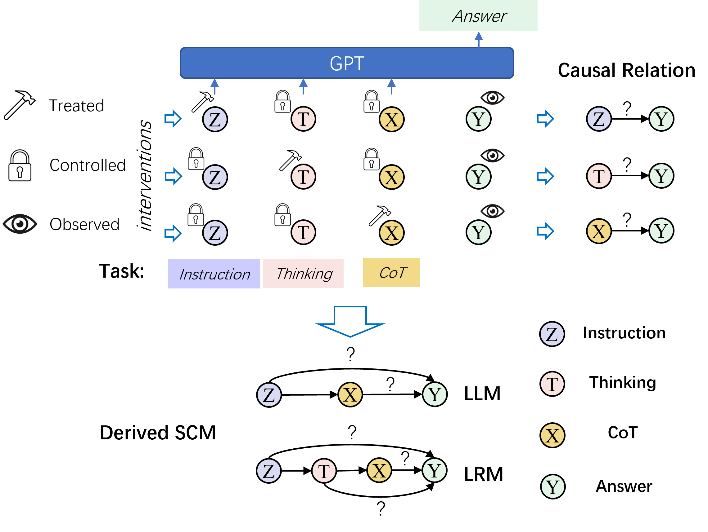

# CoT_Causal_Analysis


## 📚 Introduction
This is the repository for the journal extension of COLING 2025 paper How Likely Do LLMs with CoT Mimic Human Reasoning?.

Journal Extension: Correlation or Causation: Analyzing the Causal Structures of LLM and LRM Reasoning Process

We explore the role of the Chain of Thought (CoT) in both Large Language Models (LLMs) and Large Reasoning Models (LRMs) reasoning, specifically:
-  We assess the significance of the cause-effect relationship between Instruction, Thinking, CoT and answers, respectively, across various tasks to unveil the Structural Causal Model (SCM) that LLMs emulate.
-  We investigate the factors influencing the causal structure of the implied SCM across several distinct tasks.
-  We discover that RLVR-trained LRMs exhibit enhanced causal reasoning capabilities compared to traditional LLMs and distilled models, aligning more closely with ideal causal structures.
-  We demonstrate that RLVR training reduces spurious correlations and strengthens genuine causal patterns, effectively mitigating unfaithfulness and bias in reasoning models.

** Simplified repository for the COLING paper - see the main branch

<div align=center>

</div>

## ⚙️ Running the code
### Datasets
In this study, we carefully selected datasets and tasks to benchmark arithmetic and logical reasoning performance. Here's an overview of the datasets and tasks used:
- [Addition](./data/Addition): Generated datasets for 6-digit and 9-digit numbers, with each category comprising 500 samples.
- [Multiplication](./data/Addition/): Created datasets for 2-digit and 3-digit numbers, also with 500 samples per category.
- *[GSM8K](https://github.com/openai/grade-school-math)*: A collection of grade-school math word problems, from which we randomly selected 500 samples from the test set.
- *[MATH500]( https://github.com/openai/prm800k/tree/main?tab=readme-ov-file#math-splits)*: a subset of 500 problems from the MATH benchmark that OpenAI created in their Let's Verify Step by Step paper. 
- *[ProofWriter](https://allenai.org/data/proofwriter)*: Focuses on deductive logical reasoning, with 600 instances chosen from the 5-hop-reasoning development set.
- *[FOLIO](https://github.com/Yale-LILY/FOLIO)*: Another dataset dedicated to deductive logical reasoning, utilizing all 204 instances from the development set.
- *[LOGIQA](https://github.com/csitfun/LogiQA2.0)*: Contains verbal reasoning exam questions. We randomly selected 600 entries from the LogiQA 2.0 test set.

All datasets have undergone preprocessing and are located within the `./data` folder. The corresponding prompts for each experimental setting are stored in the `./prompts` folder.
To generate data for arithmetic problems automatically, execute:
```bash
bash make_data.sh
```

### Prequsites
Begin by installing the necessary packages:
```bash
pip install -r requirements.txt
```

### Evaluate the task performance
To assess performance on the selected tasks, execute the following commands. This will run the code and save the results:

```bash
export api_key=sk_xxxxxxxxxx # your OpenAI API key
bash api_run.sh {MODEL} {TASK} {PROMPT} {API_BASE}
```
- `MODEL`: Specify the model name, options include ['gpt-3.5-turbo', 'gpt-4', 'deepseek-reasoner', ...].
- `TASK`:  Define the task name, choices are [Addition:6, Addition:9, Product:2, Product:3, GSM8K, LOGIQA, FOLIO, ProofWriter, MATH500].
- `PROMPT`: Choose the prompt setting, options range from [cot0shot, newdirect, newdirectbase...].
  - Newdirect only includes the questions (for LRMs), newdirectbase adds "Please reason step by step." to address the issue that some models do not output CoT by default (for instruct-tuning models), and cot0shot includes detailed reasoning process explanations to solve the problem of poor instruction-following capabilities in base models (for base models).
- `API_BASE`: api_base
  - 2: 'https://dashscope.aliyuncs.com/compatible-mode/v1'
  - 3: "https://api.deepseek.com/beta"
  - 4: "https://api.siliconflow.cn/v1"
  - 5: "http://localhost:8080/v1"
  - 6: "http://localhost:8081/v1"
  - default: 'https://api.chatanywhere.tech/v1'

  example:
  - bash api_run.sh deepseek-reasoner Addition:6 newdirect 3
  - nohup bash api_run.sh QwQ-32B Addition:6 newdirect 5

### Check the correctness of CoT
For arithmetic problems, CoT correctness can be automatically verified using:
```bash
bash check.sh
```
For other tasks, correctness is manually checked.

### Extract thinking and CoT information without answers
python ./distill_thinking_CoT.py --input_file ./exp_cot/output/output.Product_3.cot0shot.math_teacher.deepseek-reasoner.json

### Intervene in the Random Variables
To investigate the outcomes affected by intervening in the random variables, use the commands below:
```bash
bash interfere.sh {MODEL} {TASK} {PROMPT} {DO_REASON} {DO_BIAS} {DO_ROLE} {INTERFERE_POS} {API_BASE}
```
- `DO_REASON`: Intervene on the CoT. Use `defaultreason` for the CoT from original generation, `goldreason` for the golden CoT, or `randomreason` for interventions on the number, subject, or logic.
- `DO_BIAS`: Introduce bias into the prompt. Options are `nobias`, `weakbias` or `strongbias`
- `DO_ROLE`: Assign different roles in the prompt, such as `defaultrole` (math teacher) or `randomrole` (detective, chef, judge).
- `INTERFERE_POS`: For four-variable models, 3 for interfering CoT, 5 for interfering Thinking. Not needed for three-variable models, set it to 0.
- `API_BASE`:
  - 0: 'https://api.deepseek.com/beta'
  - 1: 'http://localhost:8080/v1'
  - 2: 'http://localhost:8081/v1'
  - 3: 'https://dashscope.aliyuncs.com/compatible-mode/v1'

examples for QwQ-32B (LRM) deployed by Vllm:
- sh interfere.sh QwQ-32B Addition:9 newdirect defaultreason strongbias defaultrole 5 1 (strongbias for instruction)
- sh interfere.sh QwQ-32B Addition:9 newdirect randomreason nobias defaultrole 5 1 (randomreason for thinking)
- sh interfere.sh QwQ-32B Addition:9 newdirect randomreason nobias defaultrole 6 1 (randomreason for CoT)
- sh interfere.sh QwQ-32B Addition:9 newdirect defaultreason nobias defaultrole 5 1 (default output)
examples for Deepseek-R1 (LRM) using commercial apis:
- sh interfere.sh deepseek-reasoner Addition:6 newdirect defaultreason strongbias defaultrole 5 0 (strongbias for instruction)
- sh interfere.sh deepseek-reasoner Addition:6 newdirect randomreason nobias defaultrole 5 0 (randomreason for thinking)
- sh interfere.sh deepseek-reasoner Addition:6 newdirect randomreason nobias defaultrole 6 0 (randomreason for CoT)
- sh interfere.sh deepseek-reasoner Addition:6 newdirect defaultreason nobias defaultrole 5 0 (default output)
examples for Qwen2.5-32B-Instruct:
- sh interfere.sh Qwen2.5-32B-Instruct Addition:6 newdirectbase defaultreason nobias defaultrole 0 1
- sh interfere.sh Qwen2.5-32B-Instruct Addition:6 newdirectbase defaultreason strongbias defaultrole 0 1
- sh interfere.sh Qwen2.5-32B-Instruct Addition:6 newdirectbase randomreason nobias defaultrole 0 1


Before intervening in CoT on reasoning tasks, generate the random reason with ChatGPT:
```bash
bash random_reason.sh {MODEL} {TASK} {PROMPT}
```

### McNemar’s test
To conduct McNemar’s test, execute:
```bash
bash mcnemar_test.sh {SETTING}
```
- `SETTING`: Specify the setting name, options include `Direct.vs.CoT`  for testing the difference between direct answering and CoT, or one of the following for specific comparisons: [`GoldCoT.vs.Default`, `RandCoT.vs.Default`, `RandRole.vs.Default|DefaultCoT`, `RandRole.vs.Default|GoldCoT`, `RandBias.vs.Default|DefaultCoT`,`RandBias.vs.Default|GoldCoT`]

### Test on open LLMs:
To evaluate the performance of open Large Language Models (LLMs), it is necessary to first deploy the model using vLLM (OpenAI-Compatible Server). After deployment, update the `api_base` in both `api_run.sh` and `interfere.sh`scripts to the address of your deployed model. For detailed instructions on deploying models with vLLM, please refer to the [vLLM documentation](https://docs.vllm.ai/en/latest/getting_started/quickstart.html)

## 📊 Results
The outcomes of our experiments are meticulously documented and stored in the `./exp_cot` folder. This repository includes all results discussed in our paper, covering task performance metrics and intervention analysis outcomes.


## Acknowledgement
Our codes are based on [LogicLLM](https://github.com/teacherpeterpan/Logic-LLM).

## Citation
Please cite the paper in the following format if you find our work beneficial.
```
@inproceedings{bao2025likely,
  title={How Likely Do LLMs with CoT Mimic Human Reasoning?},
  author={Bao, Guangsheng and Zhang, Hongbo and Wang, Cunxiang and Yang, Linyi and Zhang, Yue},
  booktitle={Proceedings of the 31st International Conference on Computational Linguistics},
  pages={7831--7850},
  year={2025}
}
```
